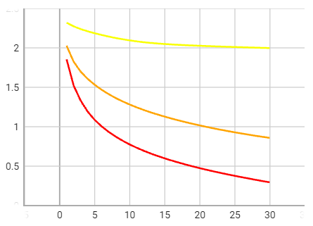
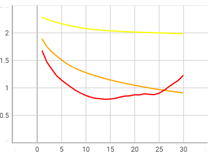
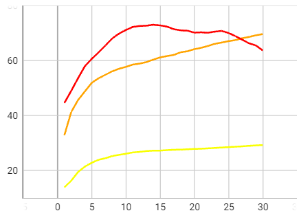
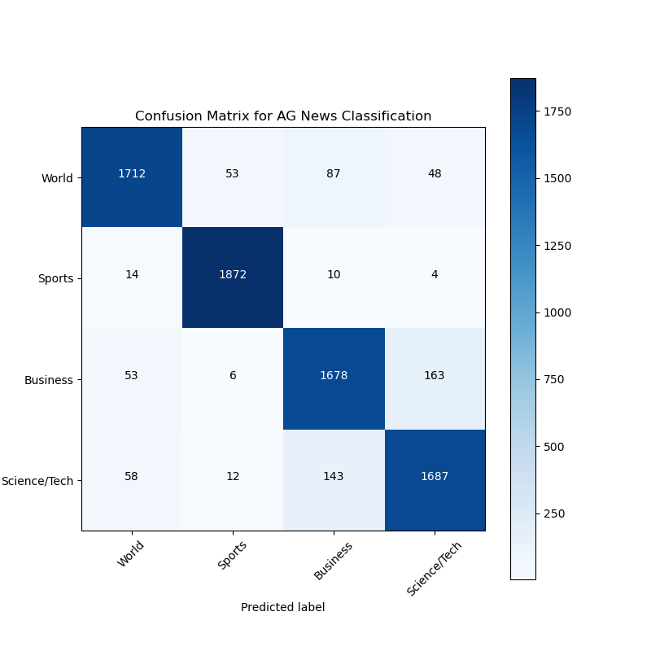

<html>
# Deep Learning Applications Labs
This repository contains the source code for the three laboratory assignments completed during the **Deep Learning Applications** course taught by **Professor Andrew David Bagdanov** ([@bagdanov](https://github.com/bagdanov) on Github). The labs cover a variety of topics related to deep learning, including convolutional neural networks, large language models, and reinforcement learning.

## Lab 1 - Convolutional Neural Networks

### Exercise 1.1: A baseline MLP
In the exercise 1.1 we have to implement a *simple Multilayer Perceptron* to classify the 10 digits of *MNIST*, implementing our own training pipeline, training this model to convergence and monitoring the loss and accuracy on the training and validation sets for every epoch.
**Tensorboard** has been used for performance monitoring.
The source code for this lab can be found in the `lab1/` directory.
#### Implementation and Results
In `trainer.py` has been implemented a **Trainer** Class. **Trainer** provides a `train()` method and a `test()` method that can be used not only for MLP, but for convolutional, residual or not, neural networks.
In the `models.py` have been implemented the three models used in this Laboratory: the **MLP**, the **CNN** and the **ResCNN**.
Tensorboard logs can be found in `lab1/model` with the saved models.
The results show the performance of the best *MLP* trained, the one with hidden-layer sizes: **[128, 64, 10]**

  
  
  

  <em>MLP Train Loss, </em>
  <em>MLP Test Loss,  </em>
  <em>MLP Test Accuracy</em>

### Exercise 1.2: Rinse and Repeat
In the exercise 1.2 we have to repeat the verification we did in exercise 1.1, but with **Convolutional** Neural Networks, showing that **deeper** CNNs *without* residual connections do not always work better whereas **even deeper** ones *with* residual connections.
This time we use *CIFAR10*, since MNIST is *very* easy.
#### Implementation and Results 
The same *Trainer* of *MLP* has benn used to train the *CNNs* and the *ResCNNs*. These time has been evaluted differents **depths** to validate the hypothesis.
For the **CNN** has been evaluated: **1, 5, 10 layers deth**
For the **ResCNN** has been evaluted: **1, 5, 10 layers depth**
*Legend:* **darker is deeper!**
##### CNN Results

  
  
  

  <em>ResCNN Train Loss, </em>
  <em>ResCNN Test Loss,  </em>
  <em>ResCNN Test Accuracy</em>

Looking at the images, considering that I did't achieved convergence in the training process for lack of time, it can be observed that,  CNN does not always benefit from an increase in depth. In fact, **CNN-depth-XX** performs better than **CNN-depth-YY** and **CNN-depth-ZZ**.

##### ResCNN Results

  

  
  
  

  <em>CNN Train Loss, </em>
  <em>CNN Test Loss,  </em>
  <em>CNN Test Accuracy</em>

This time, by observing the images, it can be seen that **increasing depth always improves ResCNN**.

### Exercise 2.1: Explain why Residual Connections are so effective
In the exercise 2.1 we have to use our CNNs (with and without residual connections) to study and **quantify** why the residual versions of the networks learn more effectively.
So i write a simple trainining loop where I train simultaneously a CNN and a ResCNN with the same layers depth for just 150 batch iterations. During the training I add to the Summary writer the **mean of the absolute values of the gradients** passing through the networks during backpropagation in the last layer of the two models, **the dense layer**.
Different layers size has been compared, all of them show the same results. The gradient magnitudes of the CNN tends to zero, showing vanishing gradient problem, instead the ResNet don't suffer of vanishing, neither exploding, gradients, even with the biggest layers depth evaluated.

### Extra: Exercise 2.3: *Explain* the predictions of a CNN
The exercise 2.3 ask to use the CNN model we trained in Exercise 1.2 and implement [*Class Activation Maps*](http://cnnlocalization.csail.mit.edu/#:~:text=A%20class%20activation%20map%20for,decision%20made%20by%20the%20CNN.):

> B. Zhou, A. Khosla, A. Lapedriza, A. Oliva, and A. Torralba. Learning Deep Features for Discriminative Localization. CVPR'16 (arXiv:1512.04150, 2015).

Instead of implementing from scratch the **Class Activation Maps** mechanism, I enjoyed using the original source code of the tecnique:
["zhoubolei/CAM"](https://github.com/zhoubolei/CAM)

#### Results
The original code required few modifications to work with my custom ResCNN. I had only to change 
*Tranforms pipeline*. 

  
  
  
  

  <em>CIFAR10 Ship, </em>
  <em>CAM CIFAR10 Ship,  </em>
  <em>Truck from internet,  </em>
  <em>CAM Truck from internet</em>

Above we can see **CAMs** resulting on a **Ship from CIFAR10**, and on **Truck image taken from the internet**.
**Ship from CIFAR10** prediction logits: 0.975 &#8594; ship, 0.022 &#8594; truck, 0.001 &#8594; else
**Truck image taken from the internet** prediction logits: 0.998 &#8594; ship, 0.001 &#8594; automobile, 0.001 &#8594; else

## Lab 2 - Large Language Models
The second lab explores large language models using the Hugging Face Transformers library. The source code for this lab can be found in the `lab2/` directory.

### Exercise 1: Warming up
In this first exercise we trained a *small* autoregressive GPT model for character generation (the one used by **Karpathy** in his video) to generate text in the style of *Dante Aligheri*, using [this file](https://archive.org/stream/ladivinacommedia00997gut/1ddcd09.txt), which contains the entire text of Dante's Inferno.

### Exercise 2: Generating Text
In this exercise we samples text from a GPT2 model, we instantiated a pre-trained `GPT2LMHeadModel` and use the [`generate()`](https://huggingface.co/docs/transformers/v4.27.2/en/main_classes/text_generation#transformers.GenerationMixin.generate) method to generate text from a prompt.

`prompt input:` Halfway down the road of life... 

`output:` Halfway down the road of life, I feel like this is pretty serious stuff. I guess I'd say it would be pretty serious if it were made so many years before someone decided they were ready to make the kind of movie it would be like

`number of characters of *Divina Commedia*:` 186001 characters

`lenght of tokenized *Divina Commedia*:` 78825 tokens

`ratio:` 0.42% of input *Divina Commedia*

### Exercise 3.1: Training a Text Classifier 
In the exercise 3.1 we have to peruse the [text classification datasets on Hugging Face](https://huggingface.co/datasets?task_categories=task_categories:text-classification&sort=downloads) to choose a *moderately* sized dataset and use a LLM to train a classifier to solve the problem.

**Note**: A good first baseline for this problem was to use an LLM *exclusively* as a feature extractor and then train a shallow model... and **that's what I've done!**

### AG News Dataset
I have chosen tu use **AG News dataset**, sourced from Hugging Face. The *AG News dataset* is a collection of news articles categorized into **four classes**

### Dataset Specifications
- **Number of Classes:** 4
- **Classes:**
  - 1: World
  - 2: Sports
  - 3: Business
  - 4: Sci/Tech
- **Total Number of Samples:** 120,000 train, 7,600 test

### Data Visualization

  
  

  

  <em>TSNE plot of train features, </em>
  <em>TSNE plot of test features</em>

### Results

  

    <em>Confusion Matrix for AG News Classification</em>

| Metric                 | Value    |
|------------------------|----------|
| Validation Accuracy    | 0.9143   |
| Validation Precision   | 0.9143   |
| Validation Recall      | 0.9143   |
| Validation F1 Score    | 0.9142   |

## Lab 3 - Reinforcement Learning

The third and final lab covers reinforcement learning, specifically deep Q learning and PPO. The source code for this lab can be found in the `lab3/` directory.

## Getting Started

To run the code in this repository, you will need to have Python 3 installed, as well as several deep learning libraries including TensorFlow, PyTorch, and Hugging Face Transformers.

To get started, clone this repository to your local machine and navigate to the directory of the lab you wish to run. From there, you can run the code using the appropriate commands.

## Contributors

This repository was created by [your name]. If you have any questions or concerns, please contact [your email].

## Acknowledgements

We would like to thank Professor Andrew David Bagdanov for teaching the "Deep Learning Applications" course and providing guidance on these labs. We would also like to acnowledge the creators of the deep learning libraries used in this repository, including TensorFlow, PyTorch, and Hugging Face Transformers.
</html>
